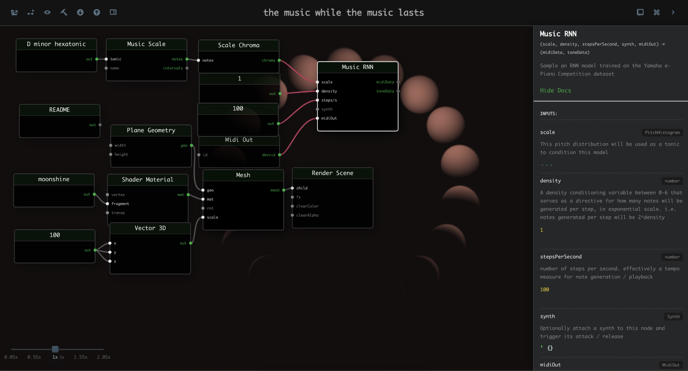
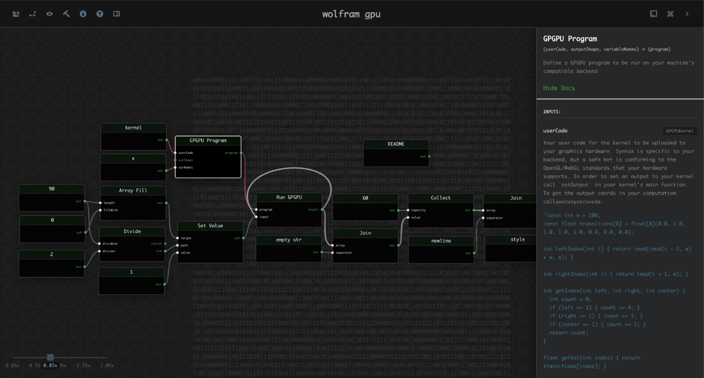

👾 welcome to the eternal 👾

<a href="https://kousun12.github.io/eternal">~~ demo ~~</a>

<a href="https://github.com/kousun12/eternal/blob/master/background/README.md">~~ writeup / explanation ~~</a>

<a href="https://github.com/kousun12/eternal/blob/master/docs.md">~~ node docs ~~</a>

This project was created for gratuitous reasons; it serves an aesthetic that I appreciate, over a medium which I feel is appropriate for its expression. 

Having spent a lot of time / mind in and around computers, my sense of aesthetics has something to do with not only the things-in-themselves, but their representations, specifically as information processes, i.e. programs. Seemingly complex phenomena which have succinct descriptions are especially beautiful to me. This project is one which allows one to describe audio/visual processes as programs, represented as a visual graph. 

You can think of it as an extension of Sol LeWitt's process art in the sense that it's goal is to decompose art into procedural descriptions. Or you can think of it as an extension of Brian Eno's idea of "music as gardening" in the sense that it gives you a computational garden to tend to.

It's inspired by an abstract and pretty beautiful idea of a functional visual programming language, but importantly, it does not go all the way. It's less interested in a clean theoretical framework than it is in being a tool that is useful in exploring audio-visual interpretations of information processing. It's not strongly-typed nodes all the way down—though that'd be nice—but seemingly useful/interesting/general nodes some of the way down.    

 

 

 

 

 

 

#### examples // myths

There are several example graphs that can be loaded from within the app itself. `cmd|ctrl + e`; you may need to zoom out to fit some graphs `cmd + -`:

###### [nude, eternally](https://kousun12.github.io/eternal?e=nude%2C%20eternally)
this is radiohead, forever. thom yorke eternally over EMaj7 - AMaj9 - G#m7. don't get any big ideas. an indeterminate, irreducible arpeggio, in 78 nodes.

  
desc

  Demonstrates raw synths (sawtooth, sine, triangle), remote sound file loading, music chords, arpeggiators, transport time, raw fragment shaders in glsl. 

###### [in the gardens of eden](https://kousun12.github.io/eternal?e=in%20the%20gardens%20of%20eden)
et in arcadia, eno. [brian](https://www.edge.org/conversation/brian_eno-composers-as-gardeners) plants his seeds as he dreams of aristotle's prime mover. along the tides in C's of entropy, terry's decomposing soul fertilizes the lilies.

  
desc

  Demonstrates musical scheduling and delays, raw fragment shaders in glsl.

###### [platonic plague](https://kousun12.github.io/eternal?e=platonic%20plague)
manifold 
to the realm of forms 
man, i fold 
to fidelity

  
desc

  Demonstrates rendering geometries, material, mesh, lights, within a scene & post processing effects.

###### [the music while the music lasts](https://kousun12.github.io/eternal?e=the+music+while+the+music+lasts)
i do not know much about gods; but i think that the river 
is a strong brown god - sullen, untamed and intractable 
i do not know much about the gods 
but i bet they sing aloud in the silence of space

  
desc

  Demonstrates music scale / chroma, RNN model, raw fragment shaders in glsl, uniform texture loading, MIDI device connections.

###### [stephen wolfram](https://kousun12.github.io/eternal?e=gpgpu+wolfram)
Stephen Wolfram is an operator that, when given a 1D cellular automata rule number [0-255] and a representation of the world, outputs the subsequent state of the world according to that rule. He will do this indefinitely and is, in fact, Earth's first eternal human.

  
desc

  Demonstrates custom gpu kernels, recursive i/o, dom rendering

###### [kolmogorov's inferno](https://kousun12.github.io/eternal?e=shaders)
It was preternaturally dark—

You know what it's like in the shipyards of Venice, 
&nbsp;&nbsp;how all winter workers boil the pitch 
&nbsp;&nbsp;to caulk and patch up their leaky ships 

When storms keep them off the roughened seas: 
&nbsp;&nbsp;one hammers out a new boat, one plugs 
&nbsp;&nbsp;the cracked seams of an old sea-worn vessel, 
One strikes the stern, another bangs on the prow, 
&nbsp;&nbsp;some make oars, others are braiding rope, 
&nbsp;&nbsp;another repairs the main, someone the lug sail; 
Well, not with fire, but with immortal heat 
&nbsp;&nbsp;a thick pitch is boiling down there and sticks 
&nbsp;&nbsp;like glue to both banks of the river. 

  
desc

  Demonstrates GLSL Fragment Shader and post render effects 

###### [etc...](https://kousun12.github.io/eternal)
and so on, until the ends.

 

 

#### Development
This might smell in some ways like consumer software, but you should understand it as an art project. While I believe that there's a place for something like this (a node-based audio / visual creative tool in the browser), this has been made as an aesthetic exploration; I will support it out of personal interests, but I don't intend to support it for the general public.

`yarn start`

Runs the app in the development mode. 
Connect to the dev server from your browser @ [localhost:3000](http://localhost:3000).

The page will reload if you make edits. 

The most important general classes you need to understand the project structure are [NodeBase](src/models/NodeBase.js), [Graph](src/models/Graph.js), and [AttributeType](src/models/AttributeType.js).

You will also see any lint errors in the console. The repo has eslint and flowtype integrated. 

`yarn build`

Builds an optimized production static site to the `build` folder. 

The build is minified and the filenames include the hashes

`yarn deploy`

gh-pages deploy script
