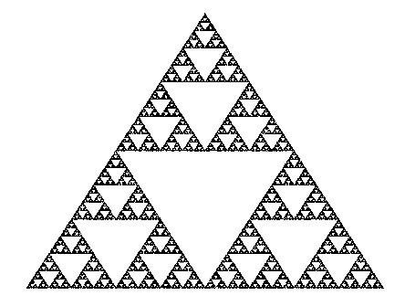

👾 welcome to the eternal 👾

<a href="https://kousun12.github.io/eternal">~~ demo ~~</a>

This project was created for gratuitous reasons; it’s an attempt to serve an aesthetic that I appreciate, over a medium which I feel is appropriate for its expression. _It is defintely more of an art project than a product._ The computationalist perspective seems to me one of the most important of our time. The relationships between computation, thinking, and perception are moving from metaphorical to formal. Art has always been the process of encoding a mental representation into an artifact. The artifact here is a program which allows the description and decision of a sub-program, encoded as a computational graph, intended to allow transcriptions of a mental representation from your bio-minds. This project tries to highlight an aesthetic quality of universal encodings that produce aesthetic artifacts as a side-effect; something like the mirth one gets when opening a well-factored bit of source code.

#### examples // myths

There are several example graphs that can be loaded from within the app itself. `cmd|ctrl + e`; you may need to zoom out to fit some graphs `cmd + -`:

###### [nude, eternally](https://kousun12.github.io/eternal?e=nude%2C%20eternally)
this is radiohead, forever. `thom yorke` eternally over `EMaj7 - AMaj9 - G#m7`. don't get any big ideas. an indeterminate, irreducible arpeggio, in 78 nodes.

  
desc

  Demonstrates raw synths (sawtooth, sine, triangle), remote sound file loading, music chords, arpeggiators, transport time, raw fragment shaders in glsl. 

###### [in the gardens of eden](https://kousun12.github.io/eternal?e=in%20the%20gardens%20of%20eden)
et in arcadia, eno. [`brian`](https://www.edge.org/conversation/brian_eno-composers-as-gardeners) plants his seeds as he dreams of aristotle's `prime mover`. along the tides in `C`s of entropy, `terry`'s decomposing soul fertilizes the lilies.

  
desc

  Demonstrates musical scheduling and delays, raw fragment shaders in glsl.

###### [platonic plague](https://kousun12.github.io/eternal?e=platonic%20plague)
manifold 
to the realm of forms 
man, i fold 
to fidelity

  
desc

  Demonstrates rendering geometries, material, mesh, lights, within a scene & post processing effects.

###### [the music while the music lasts](https://kousun12.github.io/eternal?e=the+music+while+the+music+lasts)
i do not know much about gods; but i think that the river 
is a strong brown god - sullen, untamed and intractable 
i do not know much about the gods 
but i bet they sing aloud in the silence of space

  
desc

  Demonstrates music scale / chroma, RNN model, raw fragment shaders in glsl.

###### [stephen wolfram](https://kousun12.github.io/eternal?e=stephen+wolfram)
Stephen Wolfram is an operator that, when given a 1D cellular automata rule number [0-255] and a representation of the world, outputs the subsequent state of the world according to that rule. He will do this indefinitely and is, in fact, Earth's first eternal human.

  
desc

  Demonstrates cellular automata, dom rendering, string manipulation, regular interval

###### [shaders](https://kousun12.github.io/eternal?e=shaders)
sisyphus walks the color tensor, in `YUV`

###### [etc...](https://kousun12.github.io/eternal)
and so on, until the ends.

 

 

#### Development
This might smell in some ways like consumer software, but you should understand it as an art project. While I believe that there's a place for something like this (a flow-based-programming inspired audio / visual creative tool), this has been made only as an aesthetic exploration; I don't intend to support it in any way, but you should feel at liberty to do with it what you please.

`npm start`

Runs the app in the development mode. 
Open [http://localhost:3000](http://localhost:3000) to view it in the browser.

The page will reload if you make edits. 
You will also see any lint errors in the console.

`yarn build`

Builds the app for production to the `build` folder. 
It correctly bundles React in production mode and optimizes the build for the best performance.

The build is minified and the filenames include the hashes

`yarn deploy`

Run the gh-pages deploy script

