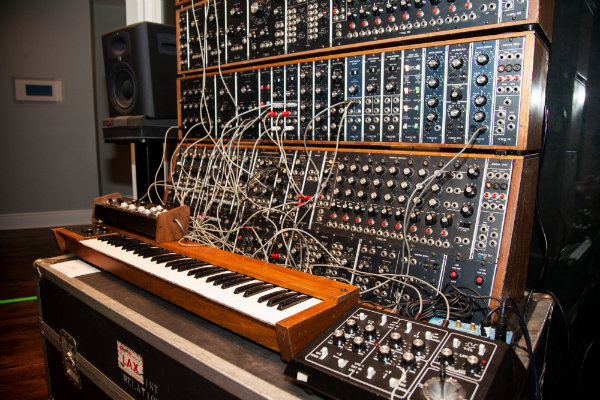
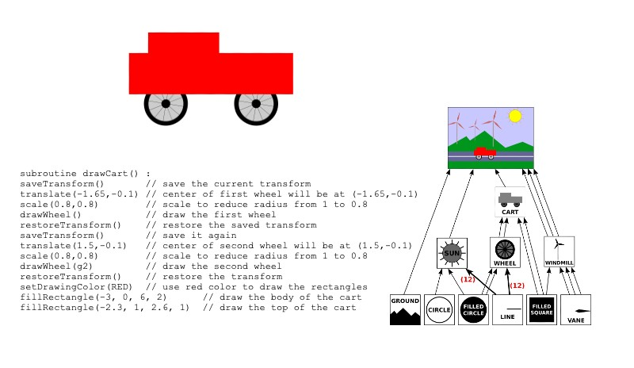

## Eternal: a node based tool for audio and visual composition on the web

Eternal is a project that I started working on in my spare time about a year ago. I thought of it as an intellectual curiosity that I worked on for either enjoyment or distraction. It was a natural synthesis of ideas on my mind since at the time, I was working on a typed information graph at Fin, while starting to learn the basics of OpenGL and musical composition. 

I wasn’t aware that pretty spirited communities existed around (still seemingly vague) things called ‘flow-based programming’, ‘dataflow programming’, and ‘visual programming’. Having worked with functional programming, reactive extensions, and Excel, I had an intuitive idea of why composing abstractions as data pipelines over functional transforms was interesting or convenient. I came across Scratch at some point after following the trails of Seymour Papert’s work, but it struck me more as a toy demonstration than a real, useful cognitive development tool. 

I’ve since found many projects similar to eternal like Houdini, vvvv, Max/MSP, cables.gl, and noflo, yet I still find it difficult to articulate what any of these things are, or exactly why they can be useful or interesting tools, particularly when I’m talking to someone who has never heard of these things.

Many people have asked me for an explanation of what eternal is, and I haven’t really spent time to come up with a good answer. It awkwardly seems like too many things mashed together:  a programming language, a virtual runtime, a programming pattern, a visual graph editor. At the same time, it also somehow feels simultaneously ‘all one inextricable thing’. This writeup tries to flesh out an explanation. 

I have no claim here to have thought of anything new or even to have made something especially useful, but I do think that this project ended up following a pretty interesting tradition of software that’s worth writing about. This is especially true given that there doesn’t seem to be much written about it.

A good way of explaining what this is might be to explain why it occurred to me to make it in the first place. 

#### All art can be described via programs

The origins of the project are pretty abstruse. I’d never had it in my mind that I wanted to make a creative tool or any kind of consumer software ‘product’. It’s been a selfish project from the start; something I used as a vehicle to explore an idea that I thought was pretty fascinating. 

One of the germs that put this project into motion was an articulation of computationalism I saw in a talk by Joscha Bach. The computationalist perspective isn’t a new idea, but it did give this project a spark. This particular setup starts with a somewhat Cartesian premise: that all of phenomenological experience is a virtual artifact of a cognitive (information) process. The model for classical computation describes a process where some initial information is iteratively evolved according to a set of predefined rules (computation over a program). Marrying these two likely leads you somewhere close to seeing conscious experience as a computational process over transduced information signals produced by some apparently non-random information generating context (the universe). In the abstract, the premise can be reduced to something like Descartes’ “Cogito, ergo sum”, but by breeding in concepts and theories from information theory and computation, we have a promising way to formally approach the understanding of consciousness: we can try to discover, implement, and run the algorithm for conscious experience (or maybe more interestingly learning) on the mechanical computers we’ve built so far. Computationalism offers a view of consciousness where a correct hypothesis is necessarily demonstrable. 

A less eternal, but still very fascinating consequence of this interpretation is that all of art at the subjective level is virtual information interpreted in the mind (photons exciting electrical impulses in the retina, local atmospheric density oscillations that pass through a geometric fourier transform in the cochlea interpreted by the brain as electrical impulses over a frequency space, haptic signals mapped over the spatial domain of a humanoid). Importantly, if we also entertain the premise that the pattern generating universe is also a computer (i.e. virtualizable), and if everything’s classical, we can use our manufactured machines (laptops, PCs, graphics cards, etc.) and software constructs to describe information processes that can, in principle, generate any conceivable human perception. One can from there, find some sense of artistry from creating algorithmic descriptions that express understanding of, and manipulations for, the tricks that are human perception. This is the central principle driving the industry called Virtual Reality, i.e. to create the Matrix, or Descartes’ evil genie -- a program whose output is human experience. Notable artists in this tradition might be Sol LeWitt with his process art instruction sets or Brian Eno with his generative music [as gardening].

#### Aspects of eternal

From this line of thinking, it didn’t feel like too far of a leap to make something like eternal as entertainment of these thoughts: music and visuals can be understood as information processes, which can be described as programs, and programs can be constructed and understood as functional graphs, so maybe we can construct a programming environment with many generically useful audio/visual functional nodes, which when composed in intentional ways, can produce music and graphics in the real world as a side-effect via whatever hardware synthesizers you have (headphones, pixel monitor, etc.). I’ll try to decompose and elaborate on the intuition in separate chunks below.

#### Programs are graphs

Whether ‘pure’ or not, the functional programming paradigm is conceptually derivative of the lambda calculus model of computation, which is functionally the same as the Turing model. State transition functions are the primitives over which you build programs as descriptions of initial state over nested functional compositions. This translates directly as seeing a program as a connected graph of information transforms, and computation as the process of running some initial state through that graph. This kind of representation has a certain aspect of legibility to it relative to the imperative model because it’s more ‘static’; you’re not describing what to do to information with control flow constructs, so much as you are describing what information is with functional relationships. One very natural way to represent an abstract graph for human comprehension (and to a slightly lesser extent, construction) is in the spatial domain of a 2D image, commonly using lines, polygons, and labels. This lends itself to why the eternal IDE is a visual graph.  

#### Functional descriptions are particularly well suited for fluent apis and graphs

One of the more illustrative examples of this sentiment is the Array; in basically all high-level languages nowadays there's a functional style of working with arrays that allows for things like map, filter, and slice. These operations are array-in, array-out, and you’ll often you see these operations chained in a single statement. This probably comes at a cost in speed and memory relative to an in-place mutating procedure in a Von Neumann architecture, but we use it because it’s more legible to software maintainers. Fluent interfaces generally decrease the abstract complexity of compositional tasks by encouraging the composer to describe their abstraction as a statically connected series of modular transforms. 

The first musical tradition to really elaborate this general idea was electronic music around the 60s and 70s, precipitated by the invention and adoption of analog modular synthesizers. The insight behind their invention is simple and ingenious. Sound can be created by mechanically transducing analog signals into pressure differentials, and these signals are portable over wires. A plain synthesizer connected voltage oscillators to hard-wired circuits that typically subtracted from or “filtered” source signals to create different harmonics. The insight that sound synthesis can be seen as a fluent interface of voltage-in-voltage-out modules is what turned some of the early synth musicians into computer programmers. With a handful of primitive circuit types, a musician could now systematically create arbitrary arbitrary sounds.

 

 
The Michael Boddicker Moog modular synthesizer

Modular synths were effectively programming languages for these musicians. You could use voltage controls in strictly internal ways to create semantically meaningful hierarchical concepts (implementation details). For example, to make a vibrato effect, patch a slow oscillator into an output oscillator’s frequency control, then package the module as a vibrato and treat it as a black box. If you have an oscillator that interprets voltage as pitch in a certain way (like the standard 1V per octave), then your pitch control signal can come from anywhere, even some long complicated chain of transforms, as long as it conforms to the voltage protocol of that module. Create an equalizer by wiring up amplitude filters to frequency range filters, or a sequencer by wiring signals to a timing circuit, or hook that sequencer’s voltage out to one of that equalizer’s inputs to create something weird. Playing music on modular synths amounts to piping signals from a generator source (like a person pressing keys on a keyboard) through a statically defined program of patched together functional modules out to some terminal speaker. 

Today in digital music, we have the MIDI protocol, and all kinds of functional transforms like panners, feedback delays, envelopes, convolvers, and gates that transport MIDI signals through compositional streams. Different component manufacturers can all contribute a link to a particular musician’s sound pipeline so long as they are MIDI compatible.

Computer graphics and scenes are similarly very naturally composed as hierarchical graphs of geometries over geometric transforms. In imperative programming you typically draw by rendering between pushes and pops from a graphics transformation stack. Functional descriptions like a graph of geometric transforms over geometries is easier to reason about since they can be interpreted statically, rather than as a function of a running program’s current transformation context. 

 

 
Drawing a cart procedurally with context transforms vs. describing a scene graph statically

 

 
Node composition in Houdini

Excel and computer spreadsheets, some of the most brilliant computer programs ever conceived, are also directly interpretable as functional programs over a fluent interface. The keras API made composing complex layered neural network graphs much more legible than in the early days of transporting and transforming tensors in a more procedural way.

#### The visual interface of a graph
So far we’ve developed an intuition for why music or visuals might be well suited for functional modelling, and how functional models lend themselves to natural interpretation as connected graphs. The last aspect of eternal worth discussing is the visual interface. It could very well have been the case that the framework was a textual interface, where you construct nodes and graphs using a textual language that conforms to a simple interpreted grammar. This would work and be technically equivalent, but I think it’d be a slightly less interesting tool to me. 

There aren’t blanket statements I can make about the visual programming interface, but I’d argue that they have a place, even if that place is in a niche. I’ve worked as a software engineer on pretty complex distributed web applications, and I don’t think I’d want to program those systems by connecting functional nodes together on a virtual canvas. At the very least, the conventional textual way of programming just has a much more developed and streamlined toolsets. Modern IDEs, editors, formatters, and linters are collectively beautiful pieces of software, and have taken the tasks of editing and navigating structured text to pretty incredible places.

In general text tends to come with concision and compactness, and visual graphs come with compositional or holistic legibility. Most graph-based programming environments have a way to “break out” and write code within a node, but come with the central conceit that the task of abstract composition is more naturally done in a spatial domain (although formatted code is also generally partially spatially interpreted by a programmer).

I find that the static functional declaration of programs tends to make it more natural to be reactive software systems, i.e. automatic downstream updates on changes, making it feel more like “live coding”, c.f. Excel or Houdini. This is particularly useful in creative domains where one wants to “play” with parameters. Generally in creative coding, I spend a good deal of time doing aesthetic tuning; in these cases a tight feedback loop feels really nice. 

The last note on the graphical interface is more speculative. It doesn’t seem like we know a lot about the underlying representations of cognitive structures, but I have a suspicion that there’s something natively predisposed in our brains toward spatial representations. It maybe even varies across people (i.e. some people report thinking about mathematics symbolically, kinesthetically, or visually, some people report aphantasia or types of synethesthetic thinking), but I tend to build up an intimacy with complex systems I’ve created in a visual graph-based editor that I don’t feel with respect to text code bases. Maybe this is just because images are interpreted coincidentally, holistically rather than sequentially with text.[1](#fn-1) Or maybe it’s an emotional response that constructing things this way gives you a tactile sense of construction that typing doesn’t. In any case, since I’ve come into contact with visual flow based programming, I’ve definitely noticed that it has a sort of cultish following that isn’t well elucidated, and so maybe that’s what I’m trying to express here. If you haven’t already tried playing around with one of these toolsets, I’d recommend that you give it a go; eternal isn’t the most sophisticated version of this tool, but it’s creation was motivated by an exploration of the thoughts written out here. 

###### <a name="fn-1">1:</a> In the niche world of memory competitions, one of the prime strategies used by almost all champions is to map a target domain (like numbers, if one is trying to memorize a random string of numbers) into an intimately known spatial domain (like waypoints in a childhood home), which might suggest something to the effect of the relative navigability of spatial models. 

